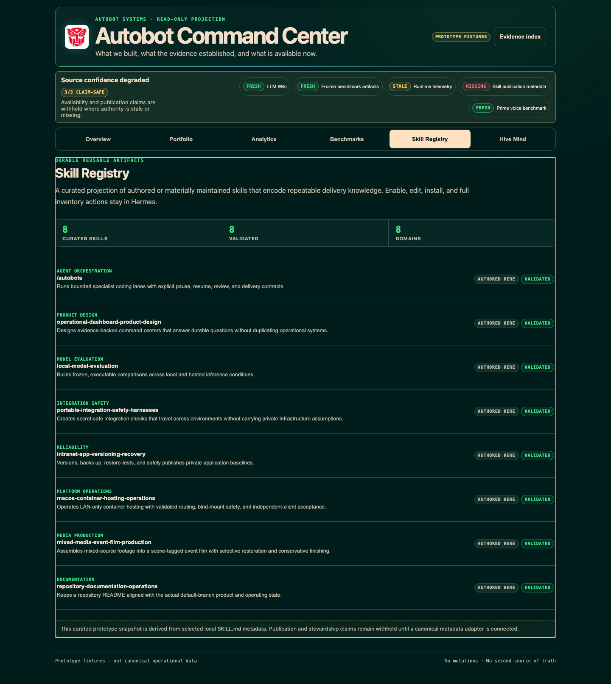
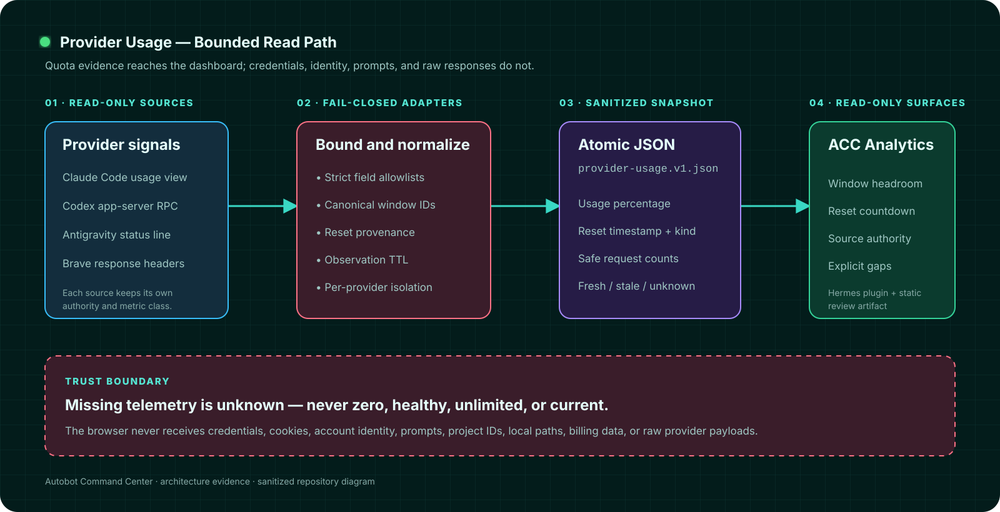
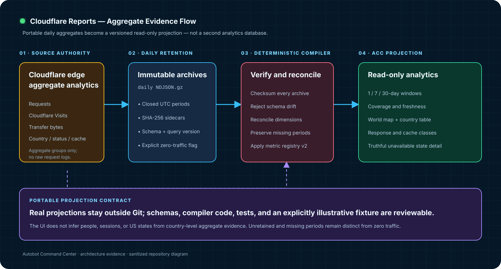

# Autobot Command Center


A read-only, mobile-first evidence dashboard for AI products, model evaluations, reusable skills, provider usage, and privacy-safe web analytics. It turns scattered operational artifacts into a claim-safe visual projection without becoming a second source of truth.

> The checked-in application uses clearly labeled demonstration fixtures. Private deployment bindings, credentials, provider-account data, live traffic projections, runtime snapshots, hostnames, addresses, and local filesystem paths are intentionally excluded.

## What it demonstrates

- **Evidence-first product UX** — every state carries authority, freshness, and explicit stale or missing behavior.
- **Privacy-safe web analytics** — Cloudflare edge aggregates are checksummed, reconciled, and projected without raw request logs or invented geography.
- **Condition-aware model evaluation** — scores belong to an exact model condition, benchmark release, and supporting run lineage.
- **Fail-closed provider usage** — missing telemetry is never presented as zero, healthy, unlimited, or current.
- **Durable portfolio and skill projections** — products, capabilities, and reusable delivery knowledge retain provenance and operating boundaries.
- **Responsive information architecture** — desktop matrices become focused, touch-friendly detail views on mobile.
- **One source, two surfaces** — the same React application builds as a Hermes dashboard plugin and as a standalone static review artifact.
- **Protected search boundary** — an optional server-side bridge uses strict request bounds, collection allowlists, origin checks, and file-mounted credentials.

## Key feature views

| Analytics index | Illustrative Cloudflare report |
|---|---|
|  |  |

| Model observatory | Skill registry |
|---|---|
|  |  |

The Cloudflare report image is generated from the repository's deterministic, explicitly non-current showcase fixture. The screenshots contain no provider-account usage or live traffic values.

## Architecture evidence

### Provider usage



Provider-specific read paths are isolated behind strict allowlists, canonical quota windows, reset provenance, and freshness rules. Only the sanitized atomic snapshot reaches the browser.

### Cloudflare reports



Daily aggregate archives are checksum-verified and reconciled against a versioned metric registry. Real projections remain mutable runtime state outside Git; the repository retains schemas, compiler code, tests, and a clearly labeled illustrative fixture.

## Local development

Requirements: Node.js 22+ and npm.

```bash
npm ci
npm test
npm run build
```

To preview the standalone artifact:

```bash
cd standalone/public
python3 -m http.server 8080 --bind 127.0.0.1
```

Then open `http://127.0.0.1:8080/`.

## Project structure

```text
src/                  shared application, analytics views, and data contracts
collector/            bounded, fail-closed provider and analytics adapters
bridge/               optional protected knowledge-search bridge
standalone/            static entry point and generated artifact
.hermes/plugins/       Hermes dashboard plugin manifest and build
ops/                   public-safe deployment templates only
tests/                 model, adapter, browser, and boundary tests
docs/                  architecture diagrams, screenshots, and recovery guidance
```

## Security and privacy

- No secrets or local deployment configuration belong in this repository.
- Mutable provider-usage and real web-analytics projections are ignored by Git.
- Public examples use placeholders, synthetic identities, and clearly labeled illustrative fixtures.
- The browser receives sanitized aggregates, never credentials, cookies, account identity, prompts, billing data, raw provider responses, or raw request logs.
- Country-level evidence is not used to infer people, sessions, or US states.
- The Autobot emblem is a third-party mark, is not covered by this repository's MIT license, and does not imply affiliation or endorsement.
- See [SECURITY.md](SECURITY.md) for reporting and deployment guidance.

## Status

Active portfolio project. The dashboard remains read-only by design; mutation, account switching, benchmark launch, and configuration controls are intentionally out of scope.

## License

[MIT](LICENSE) © Alex Geslani. Third-party marks are excluded.
