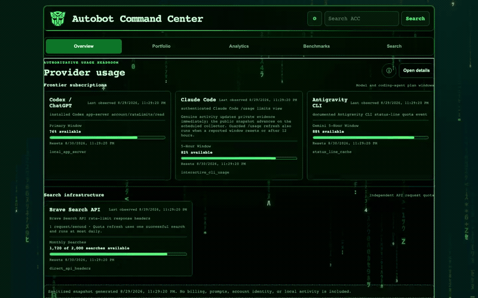
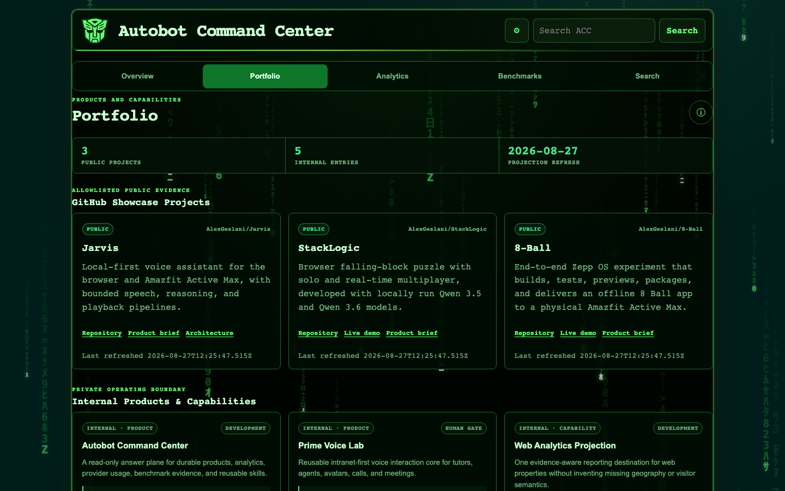
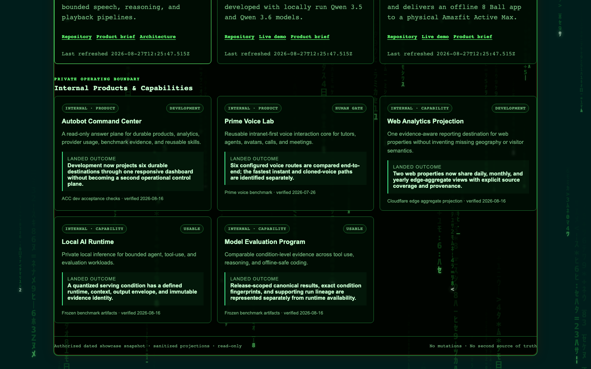
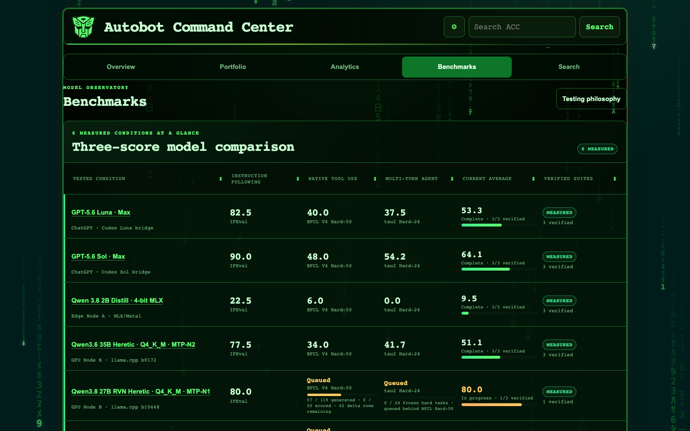
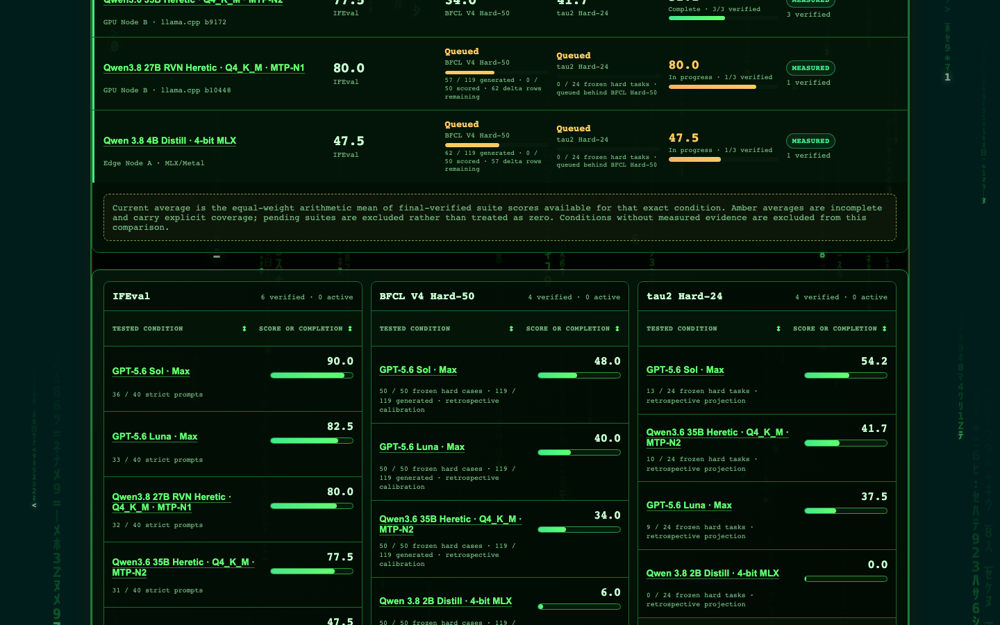
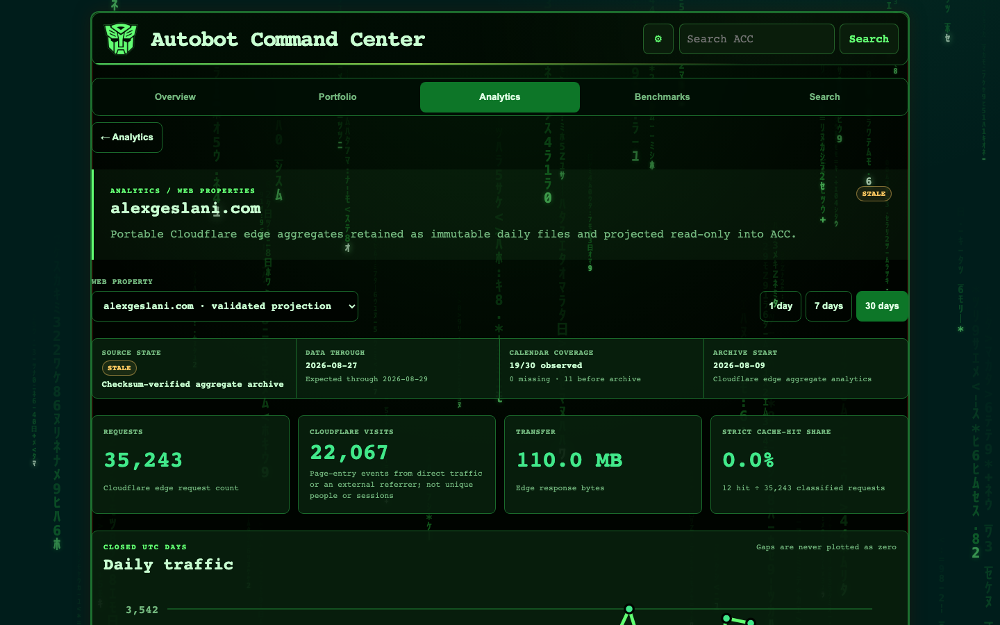
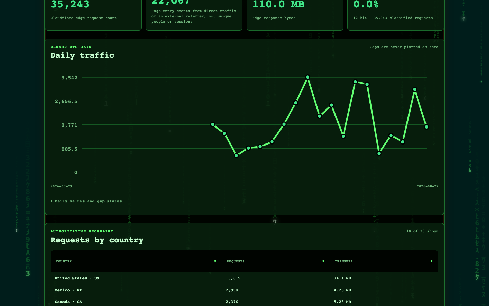
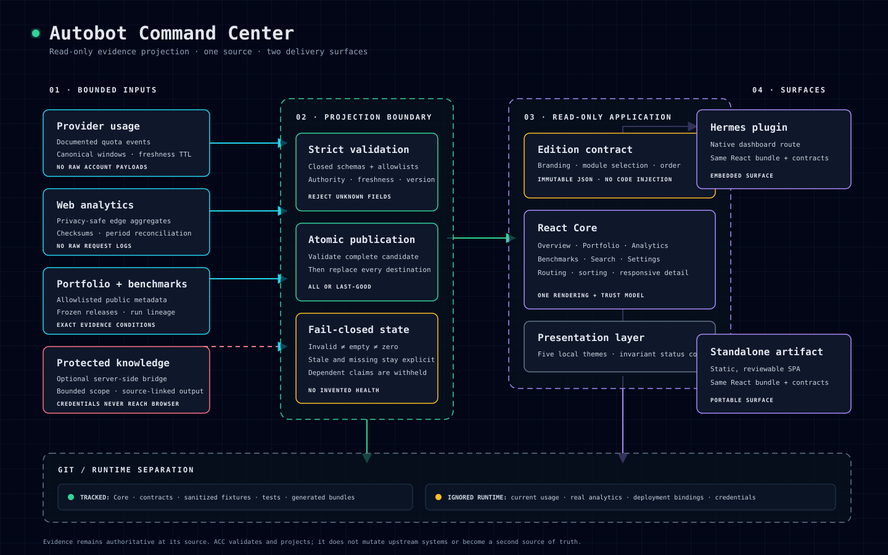

# Autobot Command Center

<p align="center">
  <strong>One command center for what my AI systems have built, how my local and frontier models actually perform, and what the evidence says right now.</strong><br>
  <sub>Built as part of Project Agent—my personal multi-agent AI lab for building, evaluating, and operating practical AI systems.</sub>
</p>

<p align="center">
  
</p>

https://github.com/user-attachments/assets/b8c132d9-6462-4b7c-a922-8d2dfe1f1aa9

<p align="center">
  <sub>68-second actual-application showcase with locally generated cinematic robotic-command narration.</sub>
</p>

> **Dated showcase snapshot — 2026-08-30.** The screenshots and film use an authorized, sanitized projection of Portfolio and Benchmark evidence plus aggregate `alexgeslani.com` analytics through 2026-08-28. The release process scans committed media and requires human review, but those checks are defense in depth—not proof that OCR can find every visual disclosure. Mutable runtime JSON remains untracked.

## What it brings together

<table>
<tr>
<td width="33%" valign="top">

### Portfolio

See what the agents have actually shipped, what each system can do, and where the evidence came from.

</td>
<td width="33%" valign="top">

### Model Observatory

Compare local and frontier models under exact benchmark conditions instead of routing workloads by vibes.

</td>
<td width="33%" valign="top">

### Analytics

Bring privacy-safe real-world usage into the same evidence surface without publishing raw request or visitor data.

</td>
</tr>
</table>

## One evidence layer. Multiple interfaces. No second source of truth.

ACC is a read-only projection—not a new authority. Product documentation, frozen benchmark artifacts, and retained aggregate analytics continue to own their facts. ACC makes those facts useful together while preserving:

- **provenance** — every claim stays attached to its authority;
- **freshness** — observation and verification dates remain visible;
- **uncertainty** — stale, invalid, missing, pending, and measured-zero states remain distinct;
- **honest absence** — missing data stays missing, and unknown never silently becomes zero.

That discipline matters because an impressive dashboard is easy to fake accidentally: flatten a missing result to `0`, detach a score from its quantization, or present historical evidence as current availability. ACC is engineered not to do that.

## What this demonstrates

Autobot Command Center is both a working product and a compact view of how I build:

- multi-agent AI systems that turn experiments into shipped outcomes;
- local inference alongside frontier-model workflows;
- frozen, reproducible benchmark conditions and evidence-backed model routing;
- privacy-safe analytics with explicit coverage boundaries;
- human-in-the-loop engineering where automation fails closed instead of inventing confidence;
- one portable React core delivered as both a Hermes plugin and a standalone application.

## Product evidence

### Portfolio: shipped systems, not a project list



The Portfolio joins three allowlisted public projects—**Jarvis**, **StackLogic**, and **8-Ball**—with dated internal capability records. Public proof and private operating capability remain visibly separate.



Each capability carries a scoped outcome, operating state, evidence authority, verification date, and limitation. Historical proof stays historical; it is not promoted into an unsupported availability claim.

### Model Observatory: exact conditions, exact results



The dated projection compares measured model conditions across three capabilities that matter in daily agent work: instruction following, native tool use, and sustained multi-turn execution. A result never floats free of its exact model, provider or runtime, quantization, reasoning mode, deployment geometry, frozen release, and denominator.



Complete and partial coverage are not cross-ranked. Pending suites remain queued or withheld rather than being treated as zero; measured zeroes remain legitimate results.

### Analytics: real aggregates with visible gaps



The authorized 30-day projection records **36,148 edge requests**, **22,630 Cloudflare Visits**, and **114.1 MB** transferred across **20 observed calendar days**, with data through **2026-08-28**. Source freshness and archive coverage remain visible so a reader can distinguish an observed value from a current claim.



Analytics retains aggregate daily traffic and country totals—not raw request logs, people, sessions, or inferred US states. Gaps are never plotted as zero.

## Architecture



ACC is split into three narrow layers:

1. **Core** owns rendering, routing, calculations, sorting, responsive behavior, and trust semantics.
2. **Edition** is immutable JSON selecting known modules, labels, branding, stable IDs, and approved relative projection locations. It cannot define executable code, trust policy, arbitrary paths, or UI behavior.
3. **Projection** is versioned JSON carrying sanitized facts with explicit authority and generation time.

Runtime writers validate a complete candidate before atomic publication. Invalid replacements are isolated, the last-good value remains available, and the dashboard reports stale, invalid, missing, or withheld states instead of silently appearing fresh or complete.

## Trust, privacy, and public-release boundary

- Secrets, credentials, private topology, local deployment configuration, mutable telemetry, and raw source responses do not belong in Git.
- Public configuration uses neutral example paths; operators provide real external paths through ignored runtime configuration or environment variables.
- Collectors and projections use closed identity, source, and field allowlists.
- The browser receives sanitized aggregates—not credentials, cookies, account identity, prompts, billing data, raw provider responses, or raw request logs.
- Tracked showcase media is a dated, owner-authorized projection, not a tracked copy of mutable runtime JSON.
- `npm run security:public` scans the text tree. `npm run security:media` inventories candidate images and video, checks metadata and full decode, extracts representative moving-image frames, and runs OCR against generic high-confidence patterns plus an optional ignored private policy.
- Automated visual scanning has known blind spots. The [public media release checklist](docs/PUBLIC_MEDIA_CHECKLIST.md) keeps full human review explicit.

See [SECURITY.md](SECURITY.md) for reporting and deployment boundaries.

## Showcase narration

<details>
<summary><strong>68-second film transcript</strong></summary>

Building AI systems is easy. Knowing what actually works is harder.

My agents ship products. Local and frontier models compete for workloads. Real systems generate evidence every day. I wanted one place to see what was real.

Portfolio tracks what we've actually shipped, what each system can do, and where the evidence came from.

The Model Observatory answers the question I care about most: which model actually performs best for my workloads?

No vibes. Exact model. Exact quant. Exact benchmark. Exact result.

Real analytics come in too, but only as privacy-safe aggregates.

Missing data stays missing. Unknown never magically becomes zero.

One evidence layer. Multiple interfaces. No second source of truth.

This is how I'm building my own AI operating system.

</details>

Narration was generated locally with Qwen3-TTS using a custom cinematic robotic-command voice. No hosted speech API was required. The direction is original and non-imitative: deep, calm, warm, authoritative, deliberate, and slightly synthetic.

## Two build targets

| Target | Output | Purpose |
|---|---|---|
| Hermes dashboard plugin | `.hermes/plugins/autobot-command-center/dashboard/dist/index.js` | Native read-only Command Center route inside Hermes |
| Standalone application | `standalone/public/` | Static review, browser testing, and portable deployment artifact |

Both targets are generated from the same source and contracts. Generated bundles are rebuilt—never hand-edited.

## Local development

**Requirements:** Node.js 22+, npm, and FFmpeg. Tesseract and ExifTool are required for the strict CI media gate; macOS can use Apple Vision OCR during local review.

```bash
npm ci
npm test
python3 -m unittest tests/test_hivemind_bridge.py
npm run build
npm run test:e2e
npm run test:standalone
npm run security:public
npm run security:media
```

Preview the standalone artifact:

```bash
node scripts/serve-standalone.mjs
```

Then open `http://127.0.0.1:9130/`.

## Project structure

```text
src/                  React core, runtime contracts, analytics, and trust semantics
config/               immutable, sanitized Edition and showcase policy
fixtures/demo/         deterministic demonstration projection for a clean clone
collector/             bounded provider and aggregate-analytics adapters
bridge/                optional protected knowledge-search bridge
standalone/            static entry point and generated artifact
.hermes/plugins/       Hermes plugin manifest and generated dashboard bundle
scripts/               build, publication, safety, and showcase-capture tools
tests/                 unit, contract, accessibility, and browser acceptance tests
docs/                  architecture, dated screenshots, film, and release checklist
```

## Design boundary

Autobot Command Center projects evidence; it does not operate the systems it observes. Account switching, benchmark launch, workflow mutation, and arbitrary browser-configured data sources are intentionally out of scope.

## Status

Public portfolio showcase. A clean clone includes deterministic sanitized demonstration data and remains reviewable without private infrastructure. Dated authorized media may show selected aggregate evidence; mutable deployment projections remain outside Git.

## Trademark notice

Autobot and related marks belong to their respective owners and are not covered by this repository's software license. This independent, unofficial, fan-inspired project is not affiliated with or endorsed by the rights holders.

## License

[MIT](LICENSE) © Alex Geslani. Third-party marks are excluded.

<!-- Maintainers: keep shipped routes, capture provenance, screenshots, demo media, architecture, and README claims synchronized. -->
