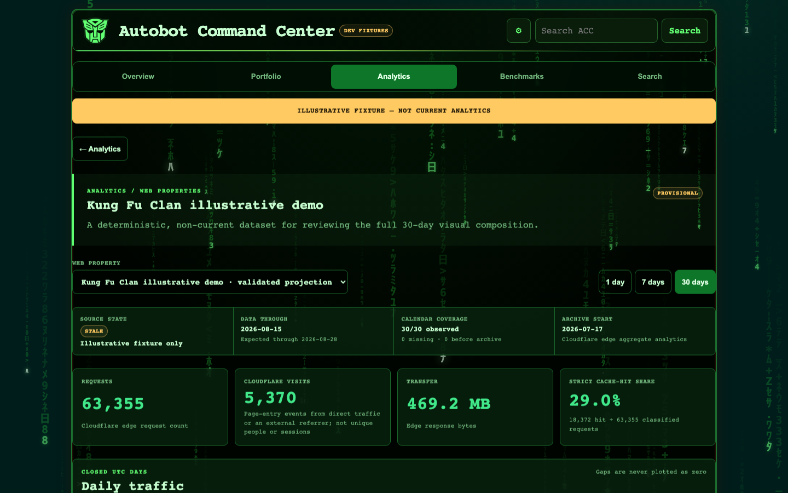
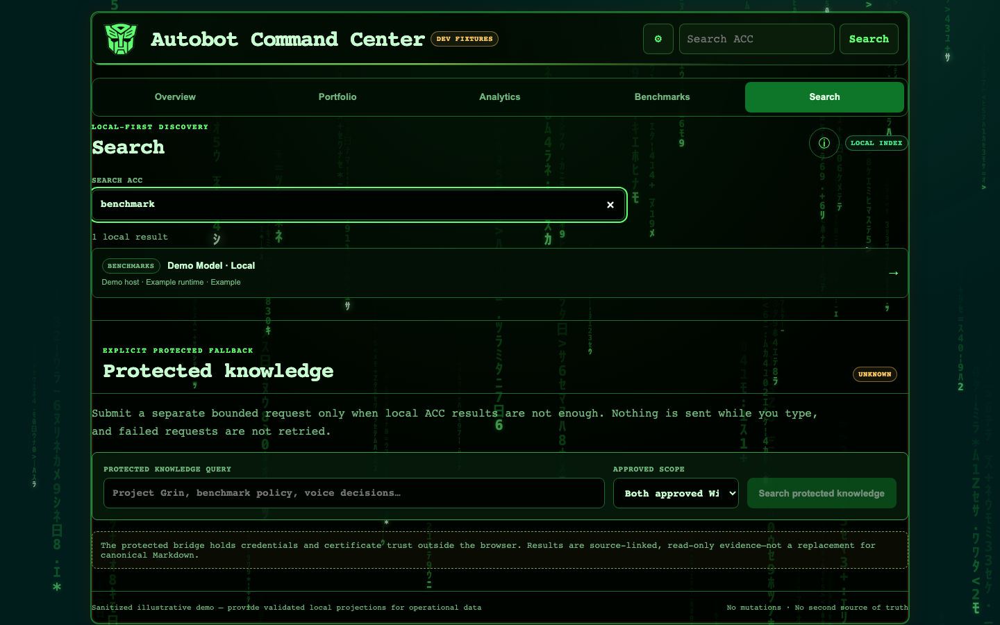
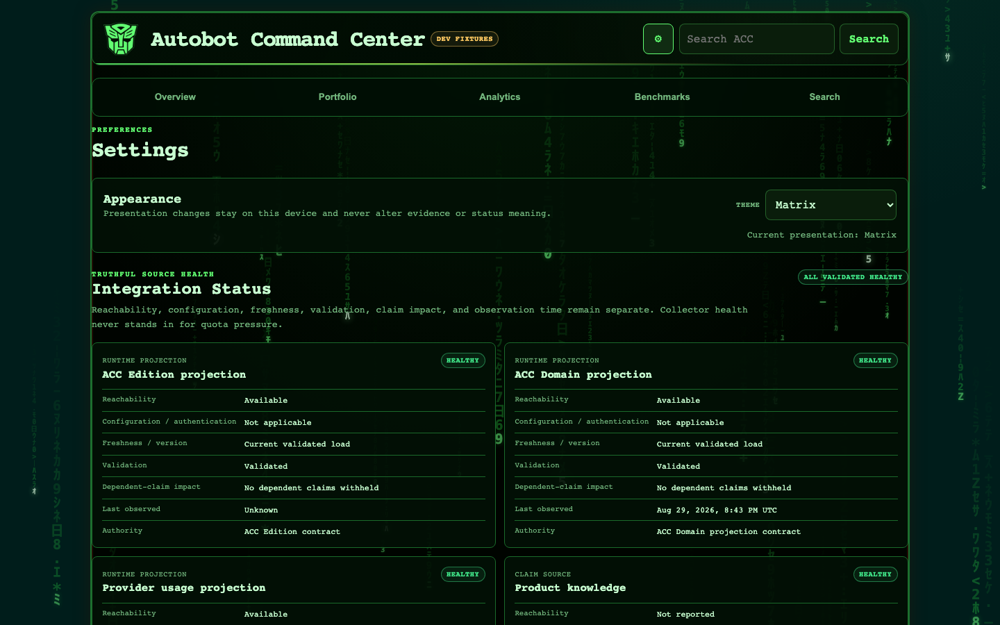
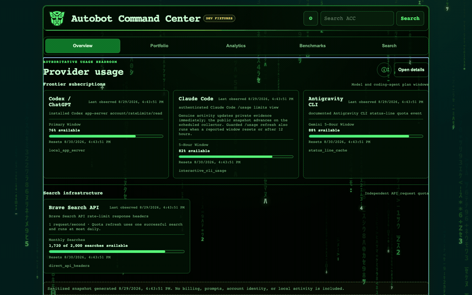

# Autobot Command Center

<p align="center">
  <strong>A read-only evidence dashboard for AI products, model evaluations, provider usage, and privacy-safe analytics.</strong><br>
  <sub>One validated projection model. Two delivery surfaces. No second source of truth.</sub>
</p>

<p align="center">
  <a href="docs/demo/autobot-command-center-demo.mp4">
    
  </a>
</p>

<p align="center">
  <strong>▶ <a href="docs/demo/autobot-command-center-demo.mp4">Watch the 90-second narrated product tour</a></strong><br>
  <sub>Narrated locally with Qwen3-TTS and the approved Prime voice profile. No hosted speech API was used.</sub>
</p>

> **Showcase boundary:** every screenshot and video frame above was captured from deterministic, sanitized demonstration fixtures with the in-product **Dev fixtures** badge visible. No credentials, account identity, prompts, billing data, private traffic, raw provider payloads, private hostnames, or local filesystem paths are present.

## Why I built it

Operational evidence tends to fragment: quota windows live in provider interfaces, product claims live in documentation, benchmark results live in frozen artifacts, and analytics live behind a separate reporting boundary. That makes a simple question—**“What do we know right now, and how confidently do we know it?”**—surprisingly expensive to answer.

Autobot Command Center turns those artifacts into a compact executive and engineering view without replacing their authoritative sources. It is intentionally read-only. Every state carries authority, freshness, validation, and explicit stale or missing behavior.

| Evidence-first | Fail-closed | Responsive | Dual-surface |
|---|---|---|---|
| Claims remain attached to provenance and observation time. | Missing telemetry is never presented as zero, healthy, unlimited, or current. | Desktop matrices become focused, touch-friendly detail views on mobile. | The same React application builds as a Hermes dashboard plugin and a standalone static artifact. |

## Architecture


### Core + Edition + Projection

ACC is deliberately split into three narrow layers:

1. **Core** owns rendering, routing, calculations, sorting, responsive behavior, and trust semantics.
2. **Edition** is immutable JSON selecting known modules, labels, branding, stable IDs, and approved relative projection locations. It cannot define code, trust policy, arbitrary paths, or UI behavior.
3. **Projection** is versioned JSON carrying sanitized facts with explicit authority and generation time.

Runtime writers validate an entire candidate before atomic publication. Invalid replacements are isolated, the last-good value remains available, and the dashboard reports a stale or invalid state instead of silently appearing fresh or blank.

## Product tour

### Overview — the decision surface


Overview leads with the things that can affect work now: validated provider headroom, integration exceptions, and compact paths into deeper evidence. It avoids turning the landing page into a wall of secondary metrics.

### Portfolio — dated capability evidence


Portfolio combines allowlisted public repository evidence with a clearly separate view of dated internal capabilities. Historical proof remains historical proof—it is never promoted into a claim of current runtime availability.

### Analytics — aggregates without surveillance


Analytics keeps web, AI-service, and product reporting domains separate. Web reporting is designed around checksummed edge aggregates rather than raw request logs; provider usage exposes bounded quota facts without browser access to provider credentials or account identity.

A separate, explicitly non-current fixture demonstrates the richer Cloudflare report surface:



### Benchmarks — exact conditions, not universal rankings


Benchmark scores belong to an exact model condition, benchmark release, denominator, and run lineage. Tool use, reasoning, coding, and sustained-agent evidence remain distinct. Complete and partial coverage are not cross-ranked, and ACC does not invent a universal score.

### Search — local first, protected only by request



Typing filters the bundled ACC index without a network request. An optional protected bridge is a separate, explicit action with bounded scopes, source-linked results, no automatic retries, and credentials held outside the browser.

### Settings — presentation changes, evidence does not



Settings exposes complete integration health while keeping presentation local to the device. Theme changes never alter status colors, evidence, authority, or freshness meaning.

## Five presentation themes



**Autobots · Decepticons · Matrix · Teletraan1 · Terminal Dark**

Matrix is the default for new sessions. Existing valid selections persist locally. Reduced-motion preferences are respected, and semantic good/warn/bad colors remain invariant across themes.

<details>
<summary><strong>Prime-narrated demo transcript</strong></summary>

Welcome to Autobot Command Center. I built it to turn scattered operational artifacts into one clear, trustworthy picture of what our AI systems can do, how recently the evidence was observed, and where uncertainty still exists.

The dashboard is read-only by design. Every source carries authority, freshness, and validation state, while private credentials and mutable account data stay outside the tracked application.

Overview gives the executive picture: provider headroom, integration exceptions, and direct paths into the evidence. Portfolio organizes public projects and dated internal capabilities without turning historical proof into a live availability claim.

Analytics presents privacy-safe aggregate reporting with explicit fixture boundaries. Benchmarks compare exact model conditions across frozen releases, keeping tool use, reasoning, and coding evidence separate instead of inventing one universal score.

Search joins local Command Center records with an optional protected knowledge bridge. Settings exposes integration health and five presentation themes: Autobots, Decepticons, Matrix, Teletraan1, and Terminal Dark.

One source builds both a Hermes dashboard plugin and a standalone static artifact. That is Autobot Command Center: evidence first, fail closed, and built to make better decisions without becoming another source of truth.

</details>

## Trust and privacy model

- **No secrets or local deployment configuration belong in Git.**
- Mutable provider usage, real web analytics, runtime projections, host bindings, environment files, keys, and certificates are Git-ignored.
- Collectors use closed provider/window allowlists and bounded public schemas.
- The browser receives sanitized aggregates—not credentials, cookies, account identity, prompts, billing data, raw provider responses, or raw request logs.
- Invalid or stale data remains visibly invalid or stale; it is never converted into reassuring defaults.
- Fixture identity is embedded in the UI so screenshots remain honest when viewed outside this README.
- Country-level analytics evidence is not used to infer people, sessions, or US states.

See [SECURITY.md](SECURITY.md) for the complete reporting and deployment boundary.

## Two build targets

| Target | Output | Purpose |
|---|---|---|
| Hermes dashboard plugin | `.hermes/plugins/autobot-command-center/dashboard/dist/index.js` | Native read-only Command Center route inside Hermes |
| Standalone application | `standalone/public/` | Static review, testing, and portable deployment artifact |

Both targets are generated from the same source and contracts. Generated bundles are rebuilt—never hand-edited.

## Local development

**Requirements:** Node.js 22+ and npm.

```bash
npm ci
npm test
npm run build
npm run test:standalone
```

Preview the standalone artifact:

```bash
node scripts/serve-standalone.mjs
```

Then open `http://127.0.0.1:9130/`.

## Project structure

```text
src/                  React Core, runtime contracts, analytics, and trust semantics
config/               immutable, sanitized Edition and showcase policy
fixtures/demo/         deterministic demonstration projection
collector/             bounded provider and aggregate-analytics adapters
bridge/                optional protected knowledge-search bridge
standalone/            static entry point and generated artifact
.hermes/plugins/       Hermes plugin manifest and generated dashboard bundle
scripts/               build, publication, safety, and showcase-capture tools
tests/                 unit, contract, accessibility, and browser acceptance tests
docs/                  architecture diagrams, screenshots, demo video, and recovery notes
```

## Design boundaries

Autobot Command Center is read-only by design. Mutation, account switching, benchmark launch, workflow control, and arbitrary browser-configured data sources are intentionally out of scope. The dashboard projects evidence; it does not operate the systems it observes.

## Status

Active portfolio project. The repository includes sanitized demonstration data so a clean clone remains reviewable without private infrastructure. Real deployment projections are supplied separately and remain outside Git.

## Trademark notice

The Autobot name and emblem are third-party marks, are not covered by this repository’s software license, and do not imply affiliation or endorsement.

## License

[MIT](LICENSE) © Alex Geslani. Third-party marks are excluded.

<!-- Maintainers: keep shipped routes, fixture boundaries, screenshots, demo media, architecture, and README claims synchronized. -->
